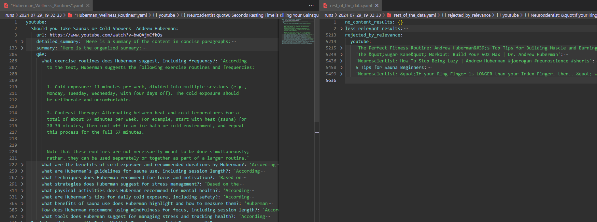
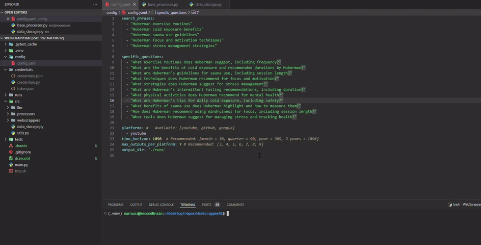

# Introduction

This project demonstrates a proof of concept for summarizing, organizing and filtering  information from different web platforms using local LLMs. It aims to offload cognitive load while exploring new domains of knowledge by automating the data summarization, organization, and filtering. This allows users to efficiently manage and understand large amounts of information from various sources simultaneously.

For more information about this idea, check out this blog: [NavigatingThroughChaos](https://mariuszjm.github.io/Portfolio/NavigatingThroughChaos/) 

## Example Input

```yaml
search_queries:
  - "Huberman exercise routines"
  - "Huberman cold exposure benefits"
  - "Huberman sauna use guidelines"
  - "Huberman focus and motivation techniques"
  - "Huberman stress management strategies"

specific_questions:
  - "What exercise routines does Huberman suggest, including frequency?"
  - "What are the benefits of cold exposure and recommended durations by Huberman?"
  - "What are Huberman's guidelines for sauna use, including session length?"
  - "What techniques does Huberman recommend for focus and motivation?"
  - "What strategies does Huberman suggest for stress management?"
  - "What are Huberman's intermittent fasting recommendations, including duration?"
  - "What physical activities does Huberman recommend for mental health?"
  - "What are Huberman's tips for daily cold exposure, including safety?"
  - "What benefits of sauna use does Huberman highlight and how to measure them?"
  - "How does Huberman recommend using mindfulness for focus, including session length?"
  - "What tools does Huberman suggest for managing stress and tracking health?"

platforms: # Available: [youtube, github, google]
  - youtube
time_horizon: 1096  # Recommended: [month = 30, quarter = 90, year = 365, 3 years = 1096]
max_outputs_per_platform: 7 # Recommended: [3, 4, 5, 6, 7, 8, 9]
output_dir: './runs'
```

## Example Output



## Gif Run Demonstration




## Key Features

- **Comprehensive Data Collection**: Gather data items from a wide range of platforms using platform APIs or web scraping.
- **Advanced Summarization and Q&A**: Utilize LLMs to summarize content and answer specific questions accurately.
- **Hierarchical Information Organization**: Arrange information hierarchically based on source relevance to address specific questions effectively.

## Future Improvements

- **Ease of Setup**:
    - Docker setup for simplified deployment.
    - Easy configuration of credentials for specific APIs with short instructions.
- Integration with other LLM platforms like OpenAI.
- Use text vector search to reduce computational requirements.

## Contact

For further information or questions, please contact mariusz.michna.j@gmail.com.
